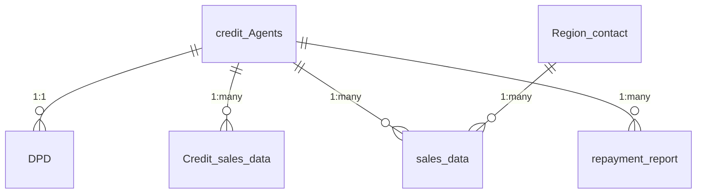

# Credit Risk Data Dictionary

This document provides detailed documentation of all data elements used in the credit risk analysis system, including field descriptions, data types, relationships, and business rules.

## Table of Contents
1. [credit_Agents.xlsx](#credit_agentsxlsx)
2. [Credit_history_sales_vs_credit_sales.xlsx](#credit_history_sales_vs_credit_salesxlsx)
3. [Credit_sales_data.xlsx](#credit_sales_dataxlsx)
4. [Region_contact.xlsx](#region_contactxlsx)
5. [DPD.xlsx](#dpsxlsx)
6. [sales_data.xlsx](#sales_dataxlsx)
7. [repayment_report.csv](#repayment_reportcsv)

## Data Relationships

## credit_Agents.xlsx

**Description**: Master list of onboarded agents with credit information including credit limits, balances, and approval details. This is the primary reference for agent credit facilities.

**File Information**:
- **Number of Rows**: 1,599
- **Update Frequency**: Daily batch, real-time for credit limit changes
- **Primary Key**: `Bzid`
- **Business Owner**: Credit Risk Team

### Data Quality Rules
- `Bzid` must be unique and non-null (8 digits)
- `Credit Limit` ≤ `Approval Amount`
- `Credit Line Balance` ≤ `Credit Limit`
- `Phone` must be 10 digits, no special characters
- `Status` must be 'A' (Active) or 'D' (Deactivated)
- `Credit Line Setup Co` must be ≤ current date

### Relationships
- **DPD.xlsx**: One-to-one on `Bzid`
- **Credit_sales_data.xlsx**: One-to-many on `Bzid`
- **sales_data.xlsx**: One-to-many on `Bzid`
- **repayment_report.csv**: One-to-many on `Bzid`

### Schema
| Column | Data Type | Description | Validation Rules |
|--------|-----------|-------------|------------------|
| `Bzid` | int64 | Unique business ID | Required, 8 digits, unique |
| `Phone` | int64 | Agent's contact number | 10 digits, no special chars |
| `Credit Line Setup Co` | datetime | When credit line was established | ≤ current date |
| `Approval Amount` | int64 | Maximum credit approved | ≥ 0, ≥ Credit Limit |
| `Credit Limit` | int64 | Current credit limit | ≤ Approval Amount, ≥ 0 |
| `Credit Line Balance` | float64 | Current outstanding balance | ≤ Credit Limit, ≥ 0 |
| `Status` | object | Account status | 'A' (Active) or 'D' (Deactivated) |

---

## Credit_history_sales_vs_credit_sales.xlsx

**Description**: Tracks monthly sales performance including both total GMV and credit-based GMV for each agent. Used for trend analysis and credit limit reviews.

**File Information**:
- **Number of Rows**: 1,416  
- **Update Frequency**: Monthly  
- **Primary Key**: `Account`  
- **Business Owner**: Business Intelligence

### Data Quality Rules
- All GMV values must be ≥ 0
- Credit GMV ≤ Total GMV for each month
- Monthly consumption % = Credit GMV / Total GMV
- No future months should have data
- Account must exist in credit_Agents

### Key Metrics
- **Total GMV**: Gross Merchandise Value (all sales)
- **Credit GMV**: Sales made on credit
- **Consumption %**: Credit GMV / Total GMV

### Schema
| Column | Data Type | Description | Validation |
|--------|-----------|-------------|------------|
| `Account` | int64 | Agent identifier | Must exist in credit_Agents |
| `*_Total GMV` | float64 | Monthly total GMV | ≥ 0 |
| `*_Credit Gmv` | float64 | Monthly credit GMV | ≤ Total GMV |
| `%*_Consumption` | float | Credit GMV / Total GMV | 0-1 range |

*Where * represents month abbreviation (e.g., Jan, Feb, Mar)

---

## Credit_sales_data.xlsx

**Description**: Detailed transaction-level data for all credit sales, used for reconciliation and analysis of credit utilization patterns.

**Number of Rows**: 6,226  
**Update Frequency**: Daily  
**Primary Key**: Composite (`account`, `DATE`, `tin`)  
**Business Owner**: Finance Operations

### Data Quality Rules
- `GMV` must be > 0
- `DATE` cannot be in future
- `tin` must be valid TIN format (8 alphanumeric)
- `account` must exist in credit_Agents

### Transaction Types
- **Regular**: Standard credit sales
- **Adjustment**: Manual adjustments
- **Reversal**: Transaction reversals
- **Write-off**: Bad debt write-offs

### Data Retention
- Current FY + 7 years (statutory requirement)
- Archived monthly after FY closure

### Relationships

- **Related to**: credit_Agents.xlsx  
  **On**: ('account', 'Bzid')  
  **Type**: many-to-one

### Columns

| Column | Data Type | Sample Values | Description |
|--------|-----------|----------------|-------------|
| `DATE` | datetime64[ns] | 2025-06-01 00:00:00, 2025-06-01 00:00:00, 2025-06-01 00:00:00 |  |
| `account` | int64 | 28115985, 28372265, 27602131 |  |
| `GMV` | float64 | 5800.0, 1699.95, 1020.0 |  |
| `tin` | object | 7AB67HK6, 7A46MMDV, 7AHH4PNE |  |

---

## Region_contact.xlsx

**Description**: Defines geographical regions and their respective sales/relationship managers. Used for regional reporting and escalation paths.

**Number of Rows**: 9
**Update Frequency**: As needed
**Primary Key**: `Region`
**Business Owner**: Sales Leadership

### Data Quality Rules
- `Region` must be unique
- `Manager` must be valid email
- `Name` must be title case

### Region Coverage
- North India
- South India
- East India
- West India
- Central India

### Columns

| Column | Data Type | Sample Values | Description |
|--------|-----------|----------------|-------------|
| `Region` | object | MP, Tamil Nadu & Kerala, Gujarat |  |
| `Manager` | object | Aswinsatheesh.work@gamil.com, Aswinsatheesh.work@gamil.com, Aswinsatheesh.work@gamil.com |  |
| `Name` | object | Aswin, Aswin, Aswin |  |

---

## DPD.xlsx

**Description**: Tracks Days Past Due (DPD) for credit accounts, indicating payment delays. Used for delinquency monitoring and risk assessment.

**Number of Rows**: 91
**Update Frequency**: Daily
**Primary Key**: `Bzid`
**Business Owner**: Collections Team

### Data Quality Rules
- `Dpd` must be non-negative integer
- `Pos` must be ≥ 0
- `Bzid` must exist in credit_Agents

### DPD Buckets
- 0: Current
- 1-29: Early Delinquency
- 30-59: Mild Delinquency
- 60-89: Severe Delinquency
- 90+: Default

### Columns

| Column | Data Type | Sample Values | Description |
|--------|-----------|----------------|-------------|
| Field | Type | Sample Values | Description | Business Rules |
|-------|------|---------------|-------------|----------------|
| `Anchor` | string | REDBUS | Business unit/partner | Must match predefined anchor list |
| `Phone` | int64 | 9885777379 | Agent contact number | Must match credit_Agents.Phone |
| `Bzid` | int64 | 24939241 | Agent business ID | Foreign key to credit_Agents |
| `Username` | string | RAHAMTHULLA SHAIK | Agent's full name | Title case, No special chars |
| `Business Name` | string | SRT travels - Rayachoti | Registered business name | Max 100 chars |
| `Dpd` | int64 | 3, 2 | Days Past Due | 0-999, 90+ = Default |
| `Pos` | float64 | 5379.30 | Principal Outstanding amount | ≥ 0, 2 decimal places |

---

## sales_data.xlsx

**Description**: Comprehensive transaction data including booking details, GMV, and agent commissions. Used for sales analysis and performance tracking.

**Number of Rows**: 13,913
**Update Frequency**: Hourly
**Primary Key**: Composite (`account`, `DATE(a.creationtime)`, `organizationname`)
**Business Owner**: Sales Operations

### Data Quality Rules
- `GMV` must be ≥ 0
- `TotalSeats` must be ≥ 1
- `status` must be valid booking status
- `account` must exist in credit_Agents

### Status Values
- BOOKED: Confirmed booking
- CANCELLED: Booking cancelled
- NO_SHOW: Customer didn't show
- COMPLETED: Service delivered

### Columns

| Column | Data Type | Sample Values | Description |
|--------|-----------|----------------|-------------|
| `DATE(a.creationtime)` | datetime64[ns] | 2025-06-01 00:00:00, 2025-06-01 00:00:00, 2025-06-01 00:00:00 |  |
| `account` | int64 | 28115985, 20692257, 28372265 |  |
| `organizationname` | object | National Travels Belgaum, Shree Tours & Travels Karad 9021250999, Prisha Tours and Travels |  |
| `status` | object | BOOKED, BOOKED, BOOKED |  |
| `TotalSeats` | int64 | 4, 1, 1 |  |
| `GMV` | float64 | 5800.0, 2280.0, 1699.95 |  |
| `AgentCommission(Exe GDS)` | float64 | 580.0, 0.0, 80.95 |  |
| `city` | object | Belagavi, Karad, Mumbai |  |
| `State` | object | Karnataka, Pune, Mumbai |  |
| `Region` | object | Karnataka, MH+Goa, MH+Goa |  |
| `Check` | bool | False, False, False |  |
| `Ro Name` | object | Sohail fazal, Bajirao  yewale, Rajkumarreddy Ranjolkar |  |
| `RM Name` | object | Shivaraj, Shivaraj, Shriram S |  |

---

