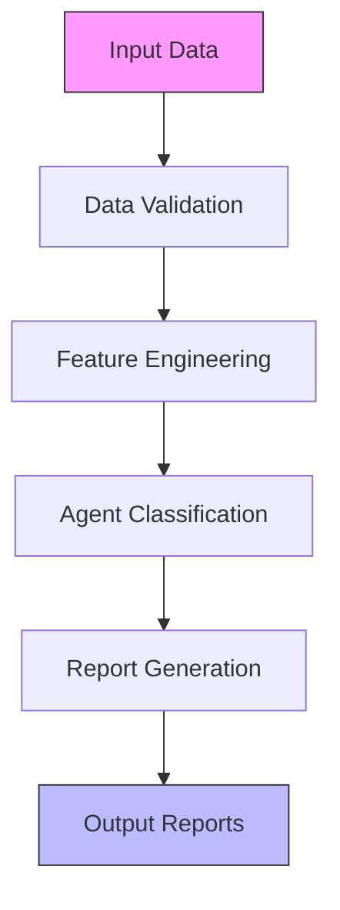

# Credit Health Intelligence Engine

[](https://opensource.org/licenses/MIT)
[](https://www.python.org/downloads/)
[](https://github.com/psf/black)
[](docs/AGENT_CLASSIFICATION.md)

A unified credit risk analysis system for monitoring and managing agent credit health based on transaction history, repayment behavior, and business metrics.

## 🏆 Key Features

- **Unified Agent Classification**: Standardized P0-P5 tiering with clear thresholds and actions
- **Risk-Based Monitoring**: Identifies and categorizes risk factors with automated alerts
- **Comprehensive Reporting**: Standardized Excel reports and markdown summaries
- **Data Quality Framework**: Built-in validation and quality checks
- **Trend Analysis**: 6-month GMV trend analysis with configurable thresholds
- **Standardized Outputs**: Consistent file naming and directory structure

## 🛠️ Getting Started

### Prerequisites

- Python 3.8+
- pip package manager
- Required Python packages (see `requirements.txt`)

### Installation

1. Clone the repository:

   ```bash
   git clone https://github.com/yourorg/credit-risk.git
   cd credit-risk
   ```

2. Create and activate a virtual environment:

   ```bash
   # Windows
   python -m venv venv
   .\venv\Scripts\activate
   
   # macOS/Linux
   python3 -m venv venv
   source venv/bin/activate
   ```

3. Install dependencies:

   ```bash
   pip install -r requirements.txt
   ```

### Configuration

1. Create a `.env` file in the project root with the following variables:
   ```env
   # Data paths
   DATA_DIR=./data/raw
   OUTPUT_DIR=./output
   
   # Logging
   LOG_LEVEL=INFO
   LOG_FILE=logs/credit_engine.log
   ```

2. Place your input files in the `data/raw/` directory:
   - `credit_agents.csv`
   - `credit_history_sales_vs_credit_sales.csv`
   - `credit_sales_data.csv`
   - `region_contact.csv`
   - `dpd.csv`
   - `sales_data.csv`

### Usage

1. Run the main analysis pipeline:

   ```bash
   python -m src.credit_health_engine
   ```

2. Generate reports for a specific region:

   ```bash
   python -m src.credit_health_engine --region "North"
   ```

3. Run tests:

   ```bash
   pytest tests/
   ```

## 📂 Project Structure

```text
credit-risk/
├── config/                 # Configuration files
├── data/                   # Data directories
│   ├── raw/                # Raw input data (immutable)
│   ├── processed/          # Processed data
│   └── external/           # External data sources
├── docs/                   # Documentation
│   ├── AGENT_CLASSIFICATION.md
│   ├── FEATURE_ENGINEERING_DOCS.md
│   ├── DATA_DICTIONARY.md
│   └── rule_book.md
├── notebooks/              # Jupyter notebooks for analysis
├── output/                 # Generated outputs
│   ├── processed/          # Processed data files
│   ├── region_reports/     # Regional analysis reports
│   ├── email_summaries/    # Email-ready summaries
│   └── logs/               # System logs
├── scripts/                # Utility scripts
│   ├── analysis/           # Analysis scripts
│   ├── data_processing/    # Data processing scripts
│   └── utils/              # Utility scripts
├── src/                    # Source code
│   └── credit_risk_analysis/
│       ├── analysis/       # Analysis modules
│       ├── data/           # Data processing
│       ├── models/         # Model definitions
│       └── utils/          # Utility functions
├── tests/                  # Test files
│   ├── unit/               # Unit tests
│   └── integration/        # Integration tests
├── .env.example           # Example environment variables
├── .gitignore
├── pyproject.toml         # Project metadata and dependencies
└── requirements.txt       # Python dependencies
```

## 📚 Documentation

### Core Documentation

- [Agent Classification](docs/AGENT_CLASSIFICATION.md) - Detailed classification criteria and thresholds
- [Feature Engineering](docs/FEATURE_ENGINEERING_DOCS.md) - Data processing and feature creation
- [Data Dictionary](docs/DATA_DICTIONARY.md) - Comprehensive data schema and standards
- [Rule Book](docs/rule_book.md) - Business rules and governance

### Quick Reference

#### Agent Classification Tiers

| Tier | Name         | Key Characteristics                          | Action          |
|------|--------------|----------------------------------------------|-----------------|
| P0   | Healthy      | 20-50% utilization, ≥80 score, no DPD       | Nurture         |
| P1   | Early Warning| Negative GMV trend or minor DPD              | Monitor         |
| P2   | High Risk    | 60+ DPD or consistent late payments          | Escalate        |
| P3   | Distressed   | 90+ DPD or score < 50                        | Restructure     |
| P4   | Churned      | No transactions for 180+ days                | Exit            |
| P5   | Inactive     | No credit utilization for 90+ days           | Re-engage       |

## System Flow



## 🤝 Contributing

1. Fork the repository
2. Create a feature branch (`git checkout -b feature/AmazingFeature`)
3. Commit your changes (`git commit -m 'Add some AmazingFeature'`)
4. Push to the branch (`git push origin feature/AmazingFeature`)
5. Open a Pull Request

## 📄 License

This project is licensed under the MIT License - see the [LICENSE](LICENSE) file for details.

## 📧 Contact

For support or questions, please contact [support@example.com](mailto:support@example.com)

---

