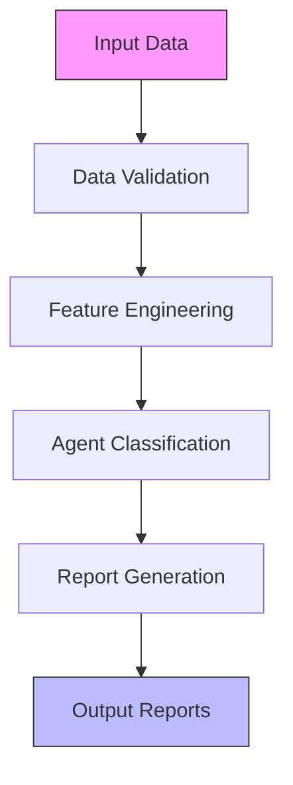

# Credit Risk Analysis System

[](https://opensource.org/licenses/MIT)
[](https://www.python.org/downloads/)
[](https://github.com/psf/black)

## Business Context & Impact

This system was built to support internal credit and operations teams in
identifying risk patterns, prioritizing agent follow-ups, and improving
credit portfolio visibility at scale.

The analysis framework enables:
- Early identification of high-risk agents
- Region-wise credit health monitoring
- Data-backed decisions for credit enablement, throttling, and recovery actions
- Faster reporting cycles with standardized outputs for ops and leadership reviews

The tool was designed for operational use, not experimentation, and focuses
on explainability, repeatability, and decision support rather than black-box scoring.


A comprehensive credit risk analysis system for monitoring and classifying credit agents based on transaction history, repayment behavior, and sales performance.

## 🚀 Key Features

- **Automated Agent Classification**: Categorizes agents into P0-P5 tiers using advanced credit behavior analysis
- **Risk Assessment**: Identifies high-risk agents and flags potential credit issues
- **Comprehensive Reporting**: Generates detailed Excel reports and email-ready summaries
- **Interactive Analysis**: Command-line interface for agent lookup and analysis
- **Data Quality Monitoring**: Built-in validation and quality checks
- **Trend Analysis**: Tracks credit utilization and sales trends over time

## 📊 System Architecture



## 📂 Project Structure

```
Credit Risk/
├── data/                    # Input data files
│   ├── raw/                 # Raw input data
│   └── processed/           # Processed data files
├── docs/                    # Documentation
│   ├── AGENT_CLASSIFICATION.md  # Agent tier criteria
│   ├── CONTEXT_MEMORY.md    # System architecture
│   ├── CREDIT_SALES_ANALYZER_ALGORITHMS.md
│   └── FEATURE_ENGINEERING_DOCS.md
├── output/                  # Generated outputs
│   ├── region_reports/      # Region-wise Excel reports
│   └── email_summaries/     # Formatted email content
├── src/                     # Source code
│   ├── agent_classifier.py  # Agent classification logic
│   ├── credit_health_engine.py  # Main processing engine
│   ├── data_dictionary.py   # Data schema and validation
│   ├── data_quality_checks.py
│   └── feature_engineering.py
├── tests/                   # Test suite
│   ├── fixtures/            # Test data
│   └── test_*.py            # Test scripts
└── tools/                   # Utility scripts
```

## 🛠️ Installation

1. **Clone the repository**:
   ```bash
   git clone https://github.com/yourusername/credit-risk-analysis.git
   cd credit-risk-analysis
   ```

2. **Create and activate a virtual environment**:
   ```bash
   python -m venv venv
   source venv/bin/activate  # On Windows: venv\Scripts\activate
   ```

3. **Install dependencies**:
   ```bash
   pip install -r requirements.txt
   ```

## 🚦 Quick Start

1. **Prepare your data**:
   - Place input files in the `data/raw/` directory
   - Ensure files follow the required naming convention

2. **Run the analysis**:
   ```bash
   python -m src.credit_health_engine
   ```

3. **View reports**:
   - Check `output/region_reports/` for Excel files
   - Find email summaries in `output/email_summaries/`

## 📚 Documentation

For detailed documentation, see the [docs](docs/) directory:

- [Agent Classification](docs/AGENT_CLASSIFICATION.md): Detailed criteria for P0-P5 agent tiers
- [System Architecture](docs/CONTEXT_MEMORY.md): Comprehensive system documentation
- [Algorithms](docs/CREDIT_SALES_ANALYZER_ALGORITHMS.md): Technical details of calculations
- [Feature Engineering](docs/FEATURE_ENGINEERING_DOCS.md): Data transformation processes

## 🧪 Testing

Run the test suite with:
```bash
pytest tests/
```

## 🤝 Contributing

1. Fork the repository
2. Create a feature branch (`git checkout -b feature/AmazingFeature`)
3. Commit your changes (`git commit -m 'Add some AmazingFeature'`)
4. Push to the branch (`git push origin feature/AmazingFeature`)
5. Open a Pull Request


- [Pandas](https://pandas.pydata.org/) - Data manipulation
- [Scikit-learn](https://scikit-learn.org/) - Machine learning
- [Matplotlib](https://matplotlib.org/) - Visualization
- [Mermaid.js](https://mermaid-js.github.io/) - Diagrams
