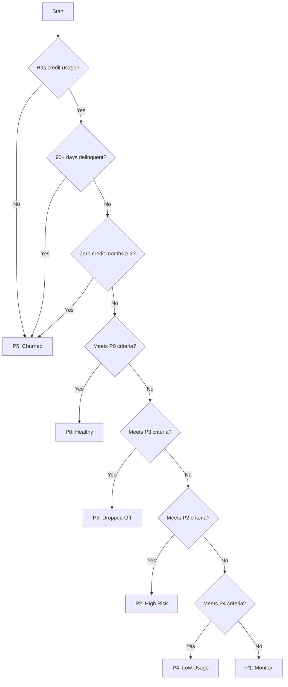

# Agent Classification System

## Overview

The Agent Classification System categorizes credit agents into six tiers (P0-P5) based on their credit behavior, repayment patterns, and business metrics. This document details the classification criteria, scoring methodology, and implementation details.

## Classification Tiers

### P0: High Usage + Timely Repayments

**Description**: Healthy agents with optimal credit usage and strong repayment history.
**Recommended Action**: Nurture

**Criteria**:

- Credit Utilization: 20-60%
- Repayment Score: ≥ 80/100
- No delinquency (30/60/90+ days)
- Positive or stable GMV trend
- Credit Health Score: ≥ 70/100
- Not credit-dependent (utilization ≤ 50%)

**Example Profile**:

- 40% credit utilization
- 90/100 repayment score
- +2% GMV trend
- No late payments
- High credit health score

---

### P1: Usage Decline or Slight Delays

**Description**: Agents showing early warning signs of credit issues.
**Recommended Action**: Follow-up

**Criteria**:

- Negative GMV trend OR
- 30-day delinquency (but not 60/90+) OR
- Credit Health Score < 80

**Example Profile**:

- 50% credit utilization
- 70/100 repayment score
- -2% GMV trend
- 30-day delinquency

---

### P2: Maxed Limit + Late Payments

**Description**: High-risk agents with credit dependence and payment issues.
**Recommended Action**: Monitor / Intervene

**Criteria**:

- High credit utilization (>50%) AND
- 30+ day delinquency

**Example Profile**:

- 80% credit utilization
- 60/100 repayment score
- 30+ day delinquency

---

### P3: Used & Repaid but Dropped Off

**Description**: Previously good agents showing declining engagement.
**Recommended Action**: Re-engage

**Criteria**:

- Historical good repayment (score ≥ 80)
- Negative GMV trend
- No current delinquency
- Previously active credit usage

**Example Profile**:

- 35% credit utilization
- 88/100 repayment score
- -3% GMV trend
- No late payments

---

### P4: Credit Available but Not Used

**Description**: Agents with available credit but low utilization.
**Recommended Action**: Educate / Activate

**Criteria**:

- Low credit utilization (<30%)
- Low credit GMV share (<25%)
- No delinquency

**Example Profile**:

- 10% credit utilization
- 100/100 repayment score
- 10% credit GMV share

---

### P5: No Use or Repayment for Long Time

**Description**: Inactive or churned agents.
**Recommended Action**: Churned — Deprioritize

**Criteria**:

- No credit usage for ≥3 months OR
- 90+ days delinquency

**Example Profile**:

- 0% credit utilization
- 0/100 repayment score
- 90+ days delinquent

## Credit Health Score Calculation

The credit health score (0-100) is calculated using three components:

### Credit Ratio (40% weight)

- Measures optimal credit utilization (peaks at 40% utilization)
- Formula: `max(0, 1 - (|utilization - 0.4| / 0.4)) * 40`

### Volatility (30% weight)

- Measures stability of credit usage
- Formula: `(1 - min(1, credit_ratio_std * 2)) * 30`

### Repayment Score (30% weight)

- Direct mapping of repayment performance
- Formula: `repayment_score * 0.3`

## Risk Indicators

### High Credit Dependence

- Triggered when credit utilization > 50%
- Used in P0 classification (must be False for P0)

### Low Credit Utilization

- Triggered when credit utilization < 30%
- Used in P4 classification

### Dormant Agent

- Triggered when zero_credit_months ≥ 3
- Used in P5 classification

## Classification Logic Flow

## Implementation Notes

### Key Files

- `src/agent_classifier.py`: Main classification logic
- `tests/test_classifier_direct.py`: Test cases for classification

### Thresholds

All thresholds are configurable via the `TierThresholds` class:

- `CREDIT_THRESHOLD_HIGH`: 0.5 (50%)
- `CREDIT_THRESHOLD_LOW`: 0.3 (30%)
- `GOOD_REPAYMENT`: 80/100
- `DORMANT_MONTHS`: 3

### Testing

Test cases cover:

- Each classification tier
- Edge cases
- Boundary conditions
- Error handling

### Maintenance

- Review classification thresholds quarterly
- Monitor distribution of agents across tiers
- Update test cases when criteria change
