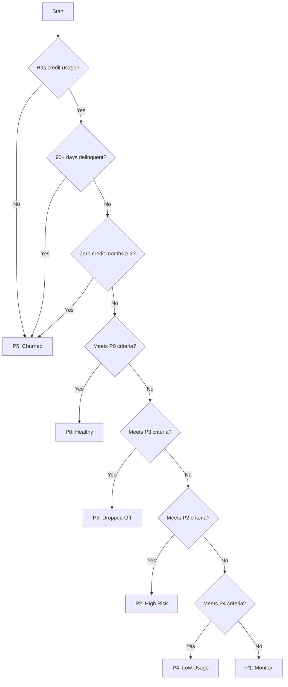

# Agent Classification System

## Overview

This document defines the unified agent classification standards for the Credit Health Intelligence Engine. It supersedes all previous documentation and establishes the canonical criteria for categorizing agents into tiers (P0-P5).

## Classification Tiers and Thresholds

| Tier | Name               | Core Criteria                                                                                                                          | Action                  |
|------|--------------------|---------------------------------------------------------------------------------------------------------------------------------------|-------------------------|
| **P0** | Healthy           | Credit utilization: **20–50%** (strict upper bound); [Repayment score](rule%20book.md#repayment-score-calculation-standards): **≥ 80/100**; No 30+/60+/90+ DPD; Positive/stable GMV trend   | Nurture                 |
| **P1** | Early Warning     | Any **negative GMV trend** OR minor delinquencies (30 DPD, not 60/90+) OR Credit Health Score < 80 (but ≥ 70)                         | Monitor                 |
| **P2** | High Risk         | **60+ DPD** OR **Consistent late payments** (3+ instances of 30+ DPD in 6 months) OR **Credit Health Score < 60**                     | Escalate                |
| **P3** | Distressed        | **90+ DPD** OR **Credit Health Score < 50** OR **Consistent non-payment** (2+ instances of 60+ DPD)                                   | Restructure/Collect     |
| **P4** | Churned           | **No transactions** for 180+ days OR **voluntary exit** OR **forced exit** (fraud, policy violation)                                  | Exit                    |
| **P5** | Inactive          | **No credit utilization** for 90+ days; no DPD; may have positive history but currently inactive                                      | Re-engage/Review        |

## Detailed Classification Logic

### P0: Healthy

**Description**: Agents with optimal credit health and strong repayment behavior.

**Criteria**:

- Credit Utilization: 20-50% (strict upper bound)
- Repayment Score: ≥ 80/100 (calculated as per [Repayment Score Calculation Standards](../docs/rule%20book.md#repayment-score-calculation-standards))
- No delinquency (30/60/90+ DPD)
- Positive or stable GMV trend
- Credit Health Score: ≥ 80/100

### P1: Early Warning

**Description**: Agents showing early signs of risk that require monitoring.

**Criteria**:

- Negative GMV trend (decreasing 6-month slope)
- OR Minor delinquencies (30 DPD, not 60/90+)
- OR Credit Health Score < 80 (but ≥ 70)

### P2: High Risk

**Description**: Agents with significant delinquency or credit health issues.

**Criteria**:

- 60+ DPD
- OR 3+ instances of 30+ DPD in 6 months
- OR Credit Health Score < 60

### P3: Distressed

**Description**: Agents in severe financial distress or default.

**Criteria**:

- 90+ DPD
- OR Credit Health Score < 50
- OR 2+ instances of 60+ DPD

### P4: Churned

**Description**: Agents who have exited the program.

**Criteria**:

- No transactions for 180+ days
- OR Voluntary exit
- OR Forced exit (fraud, policy violation)

### P5: Inactive

**Description**: Agents with no recent credit activity.

**Criteria**:

- No credit utilization for 90+ days
- No DPD
- May have positive history but currently inactive

## Credit Health Score Composition (100 points total)

1. **Repayment History (30%)**

   - On-time payments: 30 points
   - Late payments (30-59 DPD): -10 points
   - Late payments (60+ DPD): -20 points
   - Defaults: -30 points

2. **Credit Utilization (25%)**

   - 20-50%: 25 points (optimal)
   - 50-75%: 15 points
   - >75%: 5 points
   - <20%: 10 points

3. **Business Health (25%)**
   - GMV trend (6-month): 15 points
   - Transaction frequency: 10 points

4. **Relationship Length (10%)**
   - >24 months: 10 points
   - 12-24 months: 7 points
   - 6-12 months: 4 points
   - <6 months: 2 points

5. **Credit Mix (10%)**
   - Multiple product types: 10 points
   - Single product type: 5 points
- Not credit-dependent (utilization ≤ 50%)

**Example Profile**:

- 40% credit utilization
- 90/100 repayment score (calculated using weighted metrics as per standards)
- +2% GMV trend
- No late payments
- High credit health score

---

### P1: Usage Decline or Slight Delays

**Description**: Agents showing early warning signs of credit issues.
**Recommended Action**: Follow-up

**Criteria**:

- Negative GMV trend OR
- 30-day delinquency (but not 60/90+) OR
- Credit Health Score < 80

**Example Profile**:

- 50% credit utilization
- 70/100 repayment score (calculated using weighted metrics as per standards)
- -2% GMV trend
- 30-day delinquency

---

### P2: Maxed Limit + Late Payments

**Description**: High-risk agents with credit dependence and payment issues.
**Recommended Action**: Monitor / Intervene

**Criteria**:

- High credit utilization (>50%) AND
- 30+ day delinquency

**Example Profile**:

- 80% credit utilization
- 60/100 repayment score (calculated using weighted metrics as per standards)
- 30+ day delinquency

---

### P3: Used & Repaid but Dropped Off

**Description**: Previously good agents showing declining engagement.
**Recommended Action**: Re-engage

**Criteria**:

- Historical good repayment (score ≥ 80 as per repayment score standards)
- Negative GMV trend
- No current delinquency
- Previously active credit usage

**Example Profile**:

- 35% credit utilization
- 88/100 repayment score (calculated using weighted metrics as per standards)
- -3% GMV trend
- No late payments

---

### P4: Credit Available but Not Used

**Description**: Agents with available credit but low utilization.
**Recommended Action**: Educate / Activate

**Criteria**:

- Low credit utilization (<30%)
- Low credit GMV share (<25%)
- No delinquency

**Example Profile**:

- 10% credit utilization
- 100/100 repayment score (calculated using weighted metrics as per standards)
- 10% credit GMV share

---

### P5: No Use or Repayment for Long Time

**Description**: Inactive or churned agents.
**Recommended Action**: Churned — Deprioritize

**Criteria**:

- No credit usage for ≥3 months OR
- 90+ days delinquency

**Example Profile**:

- 0% credit utilization
- 0/100 repayment score (calculated using weighted metrics as per standards)
- 90+ days delinquent

## Credit Health Score Calculation

The credit health score (0-100) is calculated using three components:

### Credit Ratio (40% weight)

- Measures optimal credit utilization (peaks at 40% utilization)
- Formula: `max(0, 1 - (|utilization - 0.4| / 0.4)) * 40`

### Volatility (30% weight)

- Measures stability of credit usage
- Formula: `(1 - min(1, credit_ratio_std * 2)) * 30`

### Repayment Score (30% weight)

**Calculation Method**:
The repayment score is calculated as defined in the [Repayment Score Calculation Standards](rule%20book.md#repayment-score-calculation-standards), using a weighted combination of multiple repayment metrics including total repayment amount, principal repaid, and transaction patterns.

**Impact on Classification**:
- Scores ≥ 80: Qualify for P0 (Healthy) tier if all other criteria are met
- Scores 60-79: May qualify for P1 (Early Warning) tier
- Scores < 60: Likely P2 (High Risk) or lower, depending on other factors

- Direct mapping of repayment performance
- Formula: `repayment_score * 0.3`

## Risk Indicators

### High Credit Dependence

- Triggered when credit utilization > 50%
- Used in P0 classification (must be False for P0)

### Low Credit Utilization

- Triggered when credit utilization < 30%
- Used in P4 classification

### Dormant Agent

- Triggered when zero_credit_months ≥ 3
- Used in P5 classification

## Classification Logic Flow

## Implementation Notes

### Key Files

- `src/agent_classifier.py`: Main classification logic
- `tests/test_classifier_direct.py`: Test cases for classification

### Thresholds

All thresholds are configurable via the `TierThresholds` class:

- `CREDIT_THRESHOLD_HIGH`: 0.5 (50%)
- `CREDIT_THRESHOLD_LOW`: 0.3 (30%)
- `GOOD_REPAYMENT`: 80/100
- `DORMANT_MONTHS`: 3

### Testing

Test cases cover:

- Each classification tier
- Edge cases
- Boundary conditions
- Error handling

### Maintenance

- Review classification thresholds quarterly
- Monitor distribution of agents across tiers
- Update test cases when criteria change
