# System Architecture

## Overview

This document provides a comprehensive overview of the Credit Risk Analysis System's architecture, including data flow, component interactions, and system design.

## High-Level Architecture


## Data Pipeline

### 1. Data Loading & Validation

**Input Sources**:

- `credit_Agents.xlsx`: Agent master data
- `Credit_history_sales_vs_credit_sales.xlsx`: Historical sales data
- `DPD.xlsx`: Days Past Due information
- `sales_data.xlsx`: Transaction records
- `Region_contact.xlsx`: Regional mappings

**Validation Steps**:

1. File existence check
2. Required column validation
3. Data type verification
4. Missing value detection
5. Data consistency checks

### 2. Feature Engineering

**Key Features**:

- Credit utilization ratio
- Repayment scores
- GMV trends (3/6 month)
- Delinquency flags
- Risk indicators

**Processing Flow**:


### 3. Agent Classification

**Classification Logic**:

1. Calculate credit health score
2. Apply tier thresholds
3. Generate risk indicators
4. Assign final tier (P0-P5)

**Decision Tree**:

```mermaid
graph TD
    A[Start] --> B{Has Credit Usage?}
    B -->|No| C[P5: Churned]
    B -->|Yes| D{90+ Days Delinquent?}
    D -->|Yes| C
    D -->|No| E{Zero Credit Months ≥ 3?}
    E -->|Yes| C
    E -->|No| F{Meets P0 Criteria?}
    F -->|Yes| G[P0: Healthy]
    F -->|No| H{Meets P3 Criteria?}
    H -->|Yes| I[P3: Dropped Off]
    H -->|No| J{Meets P2 Criteria?}
    J -->|Yes| K[P2: High Risk]
    J -->|No| L{Meets P4 Criteria?}
    L -->|Yes| M[P4: Low Usage]
    L -->|No| N[P1: Monitor]
```



## Component Dependencies

### Core Components


### Class Diagram


## Data Model

### Entity Relationship Diagram


## API Design (Future)

### Endpoints

```http
GET    /api/agents               # List all agents
GET    /api/agents/{id}         # Get agent details
GET    /api/agents/{id}/scores  # Get agent credit scores
POST   /api/reports/generate    # Generate reports
GET    /api/health             # System health check
```

### Request/Response Example

**Request**:
```http
GET /api/agents/12345
Accept: application/json
```

**Response**:
```json
{
  "bzid": 12345,
  "name": "Acme Corp",
  "tier": "P1",
  "credit_score": 725,
  "risk_indicators": {
    "high_credit_dependence": true,
    "delinquent_30p": false,
    "watchlist": true
  },
  "last_updated": "2025-06-30T18:30:00Z"
}
```

## Deployment Architecture

### Infrastructure


### Scaling
- **Horizontal Scaling**: Multiple app servers behind load balancer
- **Caching**: Redis for frequently accessed data
- **Database**: Read replicas for reporting
- **Async Processing**: Celery for background tasks

## Error Handling

### Error Types
1. **Data Validation Errors**
   - Missing required files
   - Invalid data formats
   - Out-of-range values

2. **Processing Errors**
   - Feature calculation failures
   - Classification errors
   - Report generation issues

3. **System Errors**
   - Database connection failures
   - Memory issues
   - Third-party service outages

### Logging
- Structured logging in JSON format
- Log levels: DEBUG, INFO, WARNING, ERROR, CRITICAL
- Centralized log management (e.g., ELK Stack)

## Monitoring & Alerting

### Key Metrics
- API response times
- Error rates
- Queue lengths
- Resource utilization

### Alerting Rules
- P95 latency > 500ms
- Error rate > 1%
- CPU usage > 80% for 5 minutes
- Disk space < 10% free

## Security Considerations

### Data Protection
- Encryption at rest and in transit
- Role-based access control (RBAC)
- Audit logging

### API Security
- OAuth 2.0 authentication
- Rate limiting
- Input validation
- CORS configuration

## Future Enhancements

### Short-term
1. Real-time monitoring dashboard
2. Automated email notifications
3. Enhanced data validation rules

### Long-term
1. Machine learning model integration
2. Predictive analytics
3. Mobile app for field agents

## Dependencies

### Core Dependencies
- Python 3.8+
- Pandas
- NumPy
- Scikit-learn
- FastAPI (for future API)

### Development Dependencies
- Pytest
- Black
- Mypy
- Flake8

## Related Documents
- [Agent Classification](AGENT_CLASSIFICATION.md)
- [Feature Engineering](FEATURE_ENGINEERING_DOCS.md)
- [Data Dictionary](DATA_DICTIONARY.md)

---
*Last Updated: 2025-07-01*
