# Credit Risk Analysis - Context Memory

## Project Overview

The Credit Risk Analysis system is designed to monitor, analyze, and classify credit agents based on their transaction history, repayment behavior, and sales performance. The system processes multiple data sources to generate actionable insights and recommendations for credit risk management.

## System Architecture

### High-Level Architecture

### Component Interaction

### Core Components

### Main Engine (`credit_health_engine.py`)

- **Purpose**: Orchestrates the entire data processing pipeline
- **Key Responsibilities**:
  - Data loading and validation
  - Feature engineering orchestration
  - Agent classification
  - Report generation
- **Dependencies**: All other components

### Agent Classifier (`agent_classifier.py`)

- **Purpose**: Classifies agents into risk tiers (P0-P5)
- **Key Features**:
  - Implements tier classification logic
  - Calculates credit health scores
  - Provides risk indicators
- **Dependencies**: Data from feature engineering

### Data Dictionary (`data_dictionary.py`)

- **Purpose**: Defines and validates data schema
- **Key Features**:
  - Validates input data structure
  - Documents data fields and types
  - Ensures data consistency
- **Dependencies**: Input data files

### Feature Engineering (`feature_engineering.py`)

- **Purpose**: Transforms raw data into meaningful features
- **Key Features**:
  - Calculates metrics like GMV trends
  - Derives credit utilization ratios
  - Computes repayment patterns
- **Dependencies**: Raw input data

### Data Quality Checks (`data_quality_checks.py`)

- **Purpose**: Ensures data integrity and quality
- **Key Features**:
  - Validates data completeness
  - Identifies outliers
  - Checks for data consistency
- **Dependencies**: Input data validation

## Data Flow

### Data Transformation Pipeline

## Classification Decision Tree

```mermaid
graph TD
    A[Start] --> B{Has Credit Usage?}
    B -->|No| C[P5: Churned]
    B -->|Yes| D{90+ Days Delinquent?}
    D -->|Yes| C
    D -->|No| E{Zero Credit Months ≥ 3?}
    E -->|Yes| C
    E -->|No| F{Meets P0 Criteria?}
    F -->|Yes| G[P0: Healthy]
    F -->|No| H{Meets P3 Criteria?}
    H -->|Yes| I[P3: Dropped Off]
    H -->|No| J{Meets P2 Criteria?}
    J -->|Yes| K[P2: High Risk]
    J -->|No| L{Meets P4 Criteria?}
    L -->|Yes| M[P4: Low Usage]
    L -->|No| N[P1: Monitor]
    
    style C fill:#ffdddd
    style G fill:#ddffdd
    style I fill:#ffffdd
    style K fill:#ffdddd
    style M fill:#ffffdd
    style N fill:#fff3cd
```

## System Deployment

## File Descriptions

## Core Scripts

### `credit_health_engine.py`

- **Entry Point**: `main()`
- **Key Classes**:
  - `CreditHealthEngine`: Main orchestrator class
- **Key Methods**:
  - `load_data()`: Loads and validates input files
  - `engineer_features()`: Coordinates feature creation
  - `classify_agents()`: Manages agent classification
  - `generate_reports()`: Creates output reports

### `agent_classifier.py`

- **Key Classes**:
  - `AgentClassifier`: Handles agent tier classification
  - `TierThresholds`: Defines classification thresholds
- **Key Methods**:
  - `classify_agent()`: Classifies a single agent
  - `_calculate_credit_health_score()`: Computes health score
  - `_get_risk_indicators()`: Identifies risk factors

## Data Files

### Input Data

- `credit_Agents.xlsx`: Agent master data
- `Credit_history_sales_vs_credit_sales.xlsx`: Historical sales data
- `Credit_sales_data.xlsx`: Monthly credit transactions
- `DPD.xlsx`: Days Past Due information
- `sales_data.xlsx`: Complete sales transactions
- `Region_contact.xlsx`: Regional contact mapping

#### Output Data

- `output/region_reports/`: Generated Excel reports by region
- `output/email_summaries/`: Formatted email content

## System Dependencies

### Python Packages

- Core: `pandas`, `numpy`, `openpyxl`
- Visualization: `matplotlib`, `seaborn`, `plotly`
- Testing: `pytest`, `pytest-cov`
- Code Quality: `black`, `isort`, `flake8`

## Testing Framework

### Test Files

- `test_agent_classification.py`: Tests for agent classifier
- `test_feature_engineering.py`: Tests for feature calculations
- `test_data_loading.py`: Data loading validation tests
- `test_gmv_trend.py`: GMV trend calculation tests

## Configuration

### Environment Variables

- `INPUT_DIR`: Source data directory (default: 'source_data')
- `OUTPUT_DIR`: Output directory (default: 'output')
- `LOG_LEVEL`: Logging level (default: 'INFO')

## Data Processing Pipeline

### Detailed Data Flow

1. **Data Loading**
   - Load and validate input files
   - Check for required columns and data types
   - Handle missing values

2. **Feature Engineering**
   - Calculate credit utilization
   - Compute GMV trends
   - Derive repayment patterns
   - Generate risk indicators

3. **Agent Classification**
   - Assign risk tiers (P0-P5)
   - Calculate credit health scores
   - Generate recommendations

4. **Reporting**
   - Create region-wise reports
   - Generate email summaries
   - Export analysis results

## Error Handling

### Common Error Scenarios
1. **Missing Input Files**
   - Check file existence before processing
   - Provide clear error messages

2. **Data Validation Failures**
   - Validate data types and ranges
   - Handle missing or invalid data

3. **Processing Errors**
   - Implement try-catch blocks
   - Log detailed error information

## Performance Considerations

### Optimization Techniques

- Use vectorized operations with pandas/numpy
- Implement batch processing for large datasets
- Cache intermediate results when possible

## Maintenance and Extensibility

### Adding New Features

1. Add new feature calculation methods
2. Update data validation rules
3. Extend classification logic

### Documentation Updates

- Keep data dictionary current
- Update test cases
- Maintain changelog

## Security Considerations

### Data Protection

- Secure sensitive information
- Implement access controls
- Log data access

## Future Enhancements

### Planned Features

- Real-time monitoring
- Predictive analytics
- Automated alerting
- Enhanced visualization

## Troubleshooting Guide

### Common Issues

1. **Data Loading Failures**
   - Verify file permissions
   - Check file formats
   - Validate data types

2. **Classification Errors**
   - Review input data quality
   - Check threshold values
   - Validate feature calculations

## Appendix

### Related Documents

- `AGENT_CLASSIFICATION.md`: Detailed classification criteria
- `DATA_DICTIONARY.md`: Complete data schema
- `FEATURE_ENGINEERING_DOCS.md`: Feature calculation details

### Version History

- 1.0.0: Initial release

## Support
For assistance, contact the development team or refer to the project documentation.
