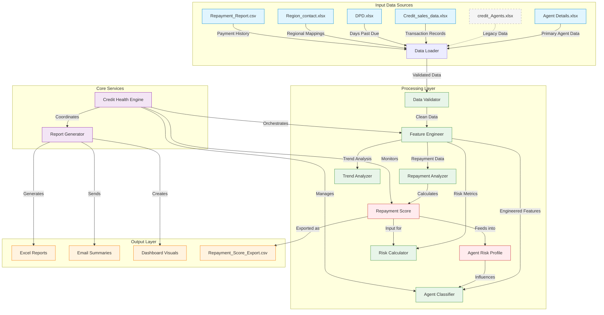

# Credit Risk Analysis System Architecture

## Core Components Overview

## Component Relationships

### 1. Input Data Layer
- **credit_Agents.xlsx**: Contains agent master data and profiles
- **Credit_sales_data.xlsx**: Transaction records and payment history
- **DPD.xlsx**: Days Past Due information for risk assessment
- **Region_contact.xlsx**: Regional mappings and contact information

### 2. Processing Layer
- **Data Loader**: Ingests and parses input files
- **Data Validator**: Ensures data quality and consistency
- **Feature Engineer**: Transforms raw data into meaningful features
  - Calculates metrics like repayment scores
  - Generates trend analyses
  - Creates risk indicators
- **Agent Classifier**: Categorizes agents based on risk profiles
- **Trend Analyzer**: Identifies patterns over time
- **Risk Calculator**: Computes risk metrics and scores

### 3. Core Services
- **Credit Health Engine**: The main orchestrator that:
  - Manages the data processing pipeline
  - Coordinates between components
  - Handles error recovery and logging
- **Report Generator**: Creates various output formats

### 4. Output Layer
- **Excel Reports**: Detailed analysis in spreadsheet format
- **Email Summaries**: Key findings and alerts
- **Dashboard Visuals**: Interactive data visualizations

## Data Flow

1. **Data Ingestion**:
   - Raw data files are loaded and validated
   - Data is cleaned and standardized

2. **Feature Engineering**:
   - Transaction data is aggregated
   - Time-series features are calculated
   - Risk indicators are computed

3. **Analysis & Classification**:
   - Agents are scored and categorized
   - Risk assessments are performed
   - Trends are identified

4. **Reporting & Output**:
   - Results are formatted for different outputs
   - Reports are generated and distributed
   - Alerts are triggered for critical findings

## Integration Points

- **Internal**:
  - Feature Engineering → Agent Classification
  - Data Validation → All processing components
  - Core Engine → All system components

- **External**:
  - Email service for report distribution
  - File system for data storage
  - (Optional) Database connections for persistent storage
