# 🌊 Credit Health Intelligence Engine


*Figure 1: High-level data flow through the Credit Health Intelligence Engine*

## 🎯 Core Objective

The **Credit Health Intelligence Engine** is a comprehensive backend analytics and segmentation system designed to support Windsurf's credit and sales enablement goals. It transforms raw transaction data into actionable insights through automated classification and risk assessment.

### Key Benefits:
- **Automated Decision Making**: Real-time agent tiering based on 20+ risk factors

- **Risk Mitigation**: Early identification of potential credit risks

- **Operational Efficiency**: Automated report generation and email alerts

- **Data-Driven Insights**: Comprehensive analytics for strategic planning

- **Continuously evaluate agent-level credit behavior**
- **Track and act on delinquency and repayment trends**
- **Generate curated, region-wise Excel + email-ready reports**
- **Inform credit line decisions, outreach prioritization, and recovery ops**

This engine merges structured data science, lending-grade heuristics, and RSM-friendly outputs to power intelligent, automated daily decision-making.

---

## 🧠 Functional Capabilities

### ✅ Data Integration

It ingests and models the following files:

| File                                        | Description                                    | Key Columns                 |
| ------------------------------------------- | ---------------------------------------------- | --------------------------- |
| `credit_Agents.xlsx`                        | Master list of credit agents                   | `Bzid`, `Phone`             |
| `DPD.xlsx`                                  | Days past due and POS summary                  | `Bzid`, `Phone`, `Dpd`      |
| `Credit_sales_data.xlsx`                    | MTD credit transactions                        | `account`, `DATE`, `GMV`    |
| `Credit_history_sales_vs_credit_sales.xlsx` | Monthly GMV and Credit GMV vs Total GMV trends | `Account`                   |
| `sales_data.xlsx`                           | Total MTD transactions                         | `account`, `GMV`            |
| `repayment_report.xlsx`                     | Repayment entries with date and amount         | `account`, `amount`, `date` |
| `region_contact.xlsx`                       | Region to Manager name/email mapping           | `Region`, `Name`, `Manager` |

### 🏗️ Feature Engineering (Core Metrics)

Each input is processed into behavioral features such as:

- **Credit Utilization Ratio** (credit used vs limit)

- **Repayment Score** (DPD behavior, time to repay, recovery attempts)

- **Credit GMV share** (credit dependency)

- **Rolling GMV Slope** (6-month trend of total GMV)

- **Delinquency Flags** (30+/60+/90+ bucket detection)

- **Repayment Normalized Score** (weighted metrics on repayment velocity and consistency)

- **Dormancy Index** (months without credit usage)

- **Region Risk Density** (% of risky agents per region)

---

## 🧪 Agent Classification System (P0–P5)

```mermaid
graph TD
    A[Start] --> B{Has Credit Usage?}
    B -->|No| C[P5: Churned]
    B -->|Yes| D{90+ Days Delinquent?}
    D -->|Yes| C
    D -->|No| E{Zero Credit Months ≥ 3?}
    E -->|Yes| C
    E -->|No| F{Meets P0 Criteria?}
    F -->|Yes| G[P0: Healthy]
    F -->|No| H{Meets P3 Criteria?}
    H -->|Yes| I[P3: Dropped Off]
    H -->|No| J{Meets P2 Criteria?}
    J -->|Yes| K[P2: High Risk]
    J -->|No| L{Meets P4 Criteria?}
    L -->|Yes| M[P4: Low Usage]
    L -->|No| N[P1: Monitor]
```



*Figure 2: Agent Classification Decision Tree*

Using engineered metrics, each agent is classified:

| Tier | Logic Highlights                         | Action              |
| ---- | ---------------------------------------- | ------------------- |
| P0   | High usage + no DPD + healthy repayments | Nurture             |
| P1   | Slight decline or minor repayment delay  | Follow-up           |
| P2   | Maxed credit + 30/60 DPD                 | Monitor             |
| P3   | Previously active + now dropped off      | Re-engage           |
| P4   | Has limit but rarely/never used          | Educate / Activate  |
| P5   | No activity / 90+ DPD                    | Deprioritize / Exit |

A weighted **Credit Health Score (0–100)** is also calculated based on:

- Credit Ratio (40%)
- Volatility (30%)
- Repayment Behavior Score (30%)

This score acts as the backbone of the classification logic.

---

## 🛠️ Project Layout

```
Credit-Risk/
├── data/
│   ├── raw/                 # Input Excel files
│   └── processed/           # Transformed feature sets
├── output/
│   ├── region_reports/      # Excel reports by region
│   └── email_summaries/     # Markdown email-ready summaries
├── src/
│   ├── agent_classifier.py       # Agent classification engine
│   ├── credit_health_engine.py   # Main pipeline runner
│   ├── feature_engineering.py    # Credit usage, repayment feature extraction
│   ├── data_dictionary.py        # Input schema & column mappings
│   ├── data_quality_checks.py    # Missing/duplicate data detection
├── tests/
│   └── test_*.py           # Unit tests for each component
├── tools/                  # Manual analysis & visualization
│   ├── analyze_data.py     # GMV, repayment distribution analysis
│   ├── check_dpd_flags.py  # Custom delinquency analyzer
│   └── visualize_tiers.py  # Bar charts / heatmaps
├── setup.py
├── README.md
└── .env                    # Local environment configs
```

---

## 🛠️ Technical Components

### Core Engine Components

| Component | Purpose | Key Features |
|-----------|---------|--------------|
| `credit_health_engine.py` | Main pipeline orchestrator | • Data loading and validation<br>• Workflow coordination<br>• Output generation |
| `agent_classifier.py` | Agent tier assignment | • Rule-based classification<br>• Credit health scoring<br>• Risk assessment |
| `feature_engineering.py` | Data transformation | • Feature calculation<br>• Trend analysis<br>• Risk indicators |
| `data_quality_checks.py` | Data validation | • Schema validation<br>• Missing data detection<br>• Outlier detection |

### Data Flow

1. **Input Layer**: Raw Excel files in `/source_data`
2. **Processing Layer**: Feature engineering and classification
3. **Output Layer**: Reports and email summaries in `/output`

### Core Engine

- `src/credit_health_engine.py`: Orchestrates the full pipeline — loads inputs, builds features, runs classification, generates outputs.
- `src/agent_classifier.py`: Applies rules, thresholds, and score weights to assign P0–P5 tiers.

### Feature Engineering

- `src/feature_engineering.py`: Builds credit usage patterns, repayment metrics, trend lines, volatility, dependency, recovery time etc.

### Reporting

- `src/email_formatter.py`: Builds markdown-formatted summaries based on region performance and key agent highlights.
- `output/region_reports/`: Excel sheets with agent-level remarks and tier labels.
- `output/email_summaries/`: Copy-paste ready weekly mailers per RSM.

### Data Quality & Schema

- `src/data_quality_checks.py`: Flags duplicate accounts, invalid dates, or missing repayment/credit rows.
- `src/data_dictionary.py`: Maps schema column headers to known attributes.

---

## ✈️ Windsurf Use-Cases

### 🎯 Regional Teams

- Use `/output/region_reports/*.xlsx` to review risky agents
- Take action on P1, P2, and P3 categories
- Forward auto-generated mailers for nudges and escalations

### 🧾 Credit Team

- Use behavioral trends to decide top-ups, soft lock or disablement
- Use DPD and repayment score to override tier ratings

### 🔁 Collections

- Identify P2/P3/P5 agents for field or automated recovery
- Prioritize follow-up based on Credit Health Score

---

## 🔮 Roadmap

| Phase | Feature                          | Owner      | Status      |
| ----- | -------------------------------- | ---------- | ----------- |
| 1     | Manual tier generation + mailers | Done       | ✅ Live      |
| 2     | Auto-email to RSM                | Credit Ops | Planned     |
| 3     | ML Clustering on usage/repayment | DS Team    | In Proposal |
| 4     | Web dashboard                    | Product    | Exploratory |

## 📞 Support & Contact

For assistance, please contact:

- **Support Email**: [credit-ops@example.com](mailto:credit-ops@example.com)
- **System Admin**: [admin@example.com](mailto:admin@example.com)
- **Office Hours**: Mon-Fri, 9AM-6PM IST

## 🔗 Related Documentation

- [System Architecture](ARCHITECTURE.md)
- [Agent Classification](AGENT_CLASSIFICATION.md)
- [Data Dictionary](DATA_DICTIONARY.md)
- [Feature Engineering](FEATURE_ENGINEERING_DOCS.md)

---

*Documentation last updated: 2025-07-01*

## 🚀 Quick Start Guide

### Prerequisites

- Python 3.8+
- Required packages (see `requirements.txt`)
- Input data files in `/source_data`

### Running the Analysis

```bash
python -m src.credit_health_engine
```

### Accessing Results

- Reports: `/output/region_reports/`
- Email Summaries: `/output/email_summaries/`
- Logs: `credit_health_engine.log`

## 📌 TL;DR for Windsurf

The **Credit Health Intelligence Engine** is a production-grade backend solution that:

- Turns raw data into actionable tiers
- Powers RSM nudges through mailers
- Flags agent risk across 6 dimensions
- Enables dynamic, region-wise prioritization

Use it as your daily heartbeat monitor for credit agents.

---
